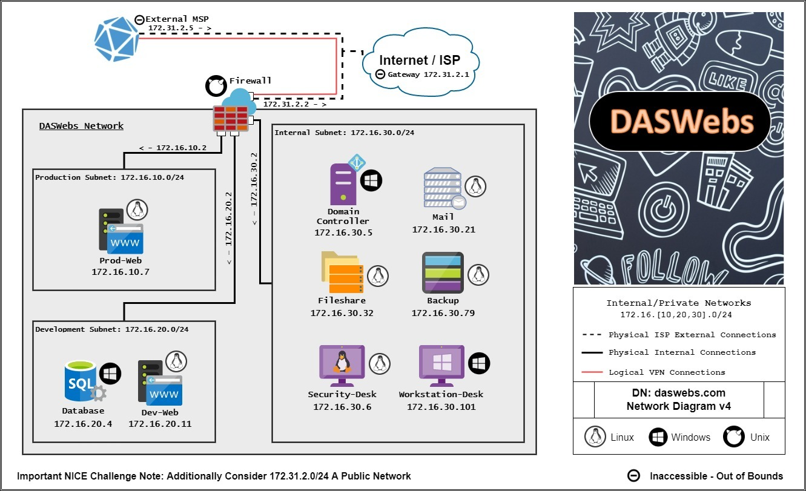
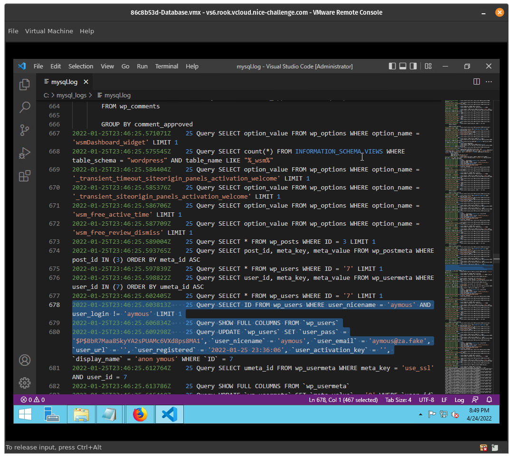
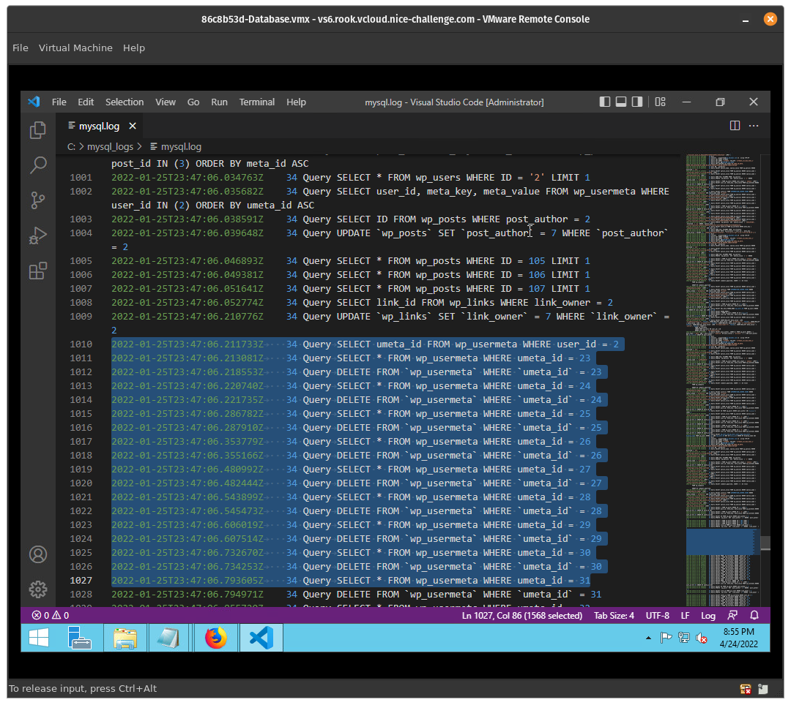
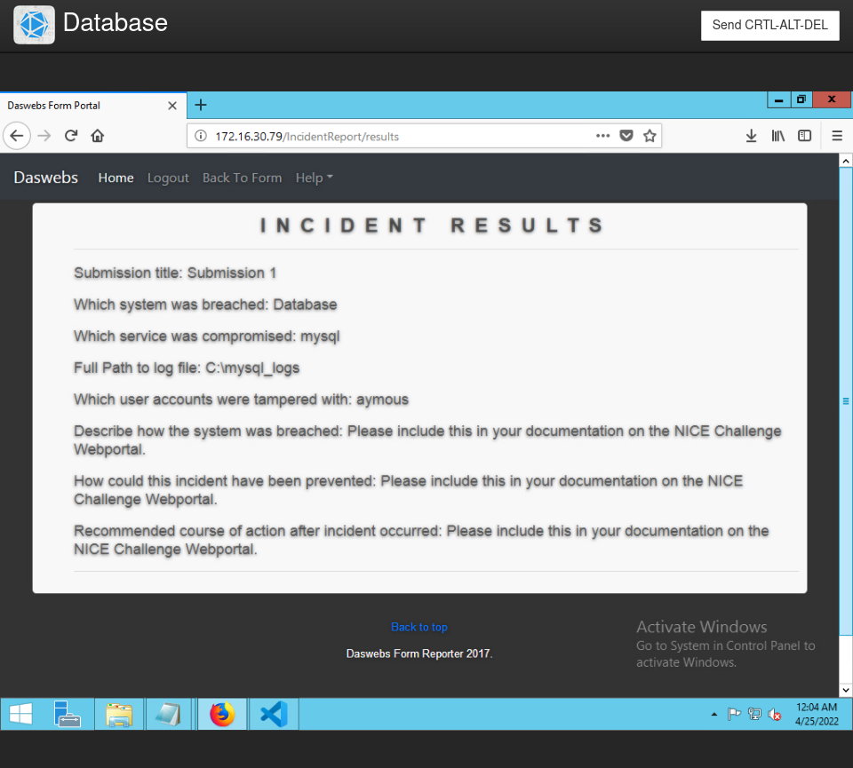
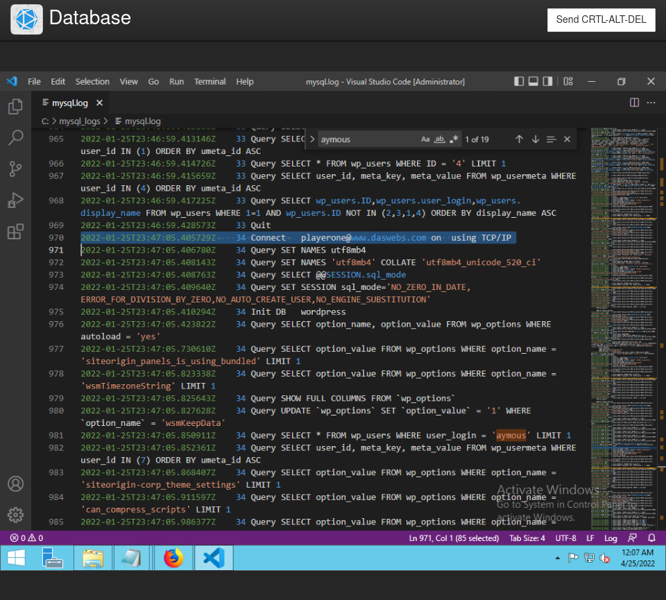
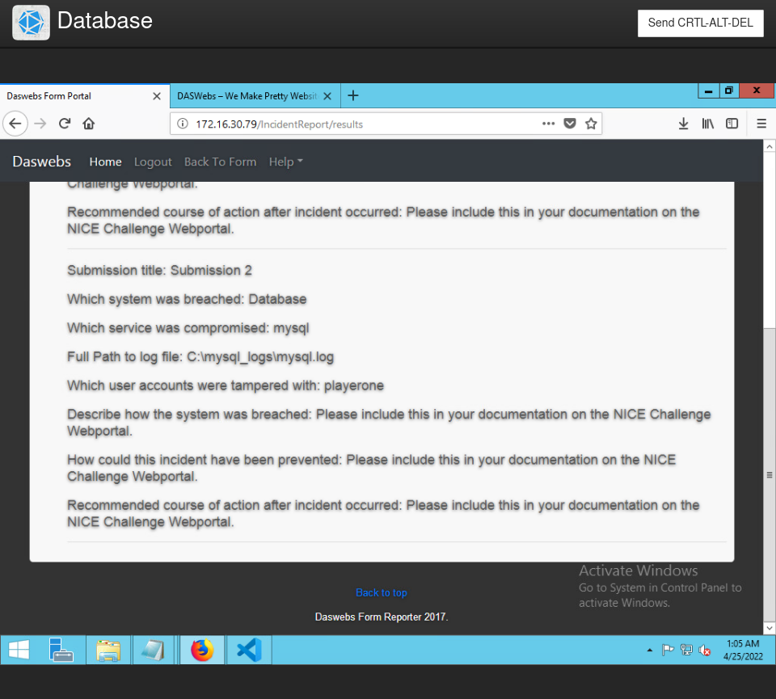

# Challenge 08 (T0166) - Lengthy Logs: Attack Analysis

## Challenge Info
**Author:** Alexander Hillock & Daniel Killam & Luis Pena 
**Framework Category:** Protect and Defend 
**Specialty Area:** Cybersecurity Defense Analysis 
**Work Role:** Cyber Defense Analyst 
**Task Description:** Perform event correlation using information gathered from a variety of sources within the enterprise to gain situational awareness and determine the effectiveness of an observed attack.

### Scenario
Lately, employees have been having some issues logging in to one of our Wordpress websites and we can't figure out why. Our security analyst suspects that we might have been hit by a cyber attack, but is currently indisposed and can't look into it. I need you to take a look and confirm whether or not we were actually hit and if so, what the impact of that attack might have been.

### Additional Information
More details and objectives about this challenge will be introduced during the challenge meeting, which will start once you begin deploying the challenge.

You will be able to check your progress during this challenge using the check panel within the workspace once the challenge is deployed. The checks within the check panel report on the state of some or all of the required tasks within the challenge.

Once you have completed the requested tasks, you will need to document the methodology you used with as much detail and professionalism as necessary. This should be done on the documentation tab within the workspace once the challenge is deployed. Below the main documentation section be sure to include a tagged list of applications you used to complete the challenge.

Your username/password to access all virtual machines and services within the workspace will be the following...

**Username:** `playerone` 
**Password:** `password123`

The username/password used to access the Firewall's web interface within the workspace will be the following...

**Username:** `admin`
**Password:** `password123`

The web form used for this challenge accepts 8 submissions.
When evaluating individual check states, the automated check system ignores submissions made beyond this limit.

## Meeting Notes

## Network Map

## Documentation
Logging into `Database` (`172.16.20.4`)
Navigated to `C:\mysql_logs`. Found logs, but it's hard to interpret them.

Installing VSCode.

Checks in the challenge:

- [x] Correctly Reported Exploited Host and Service
  - `Database`
- [x] Correctly Reported Exploited Service Log File Path
  - 
- [x] Correctly Reported Wordpress Account[s] Subjected to Tampering
  - 

Line 678, start of suspicious activity

Line 1010, deleting user account entries

Attempt 1, incorrect

Line 970, attacker used `playerone` maybe?

copy `mysql.log` file to `dasShare`

Attempt 2, fixed filepath to log

Need to perhaps use database backup to find deleted users?

Log into `backup` machine

SCP database backup `wordpress.sql` to `Security-Workstation`

user IDs deleted:
- 23 - 36
- 38 - 40
- 41 - 54
- 1 - 22
- 55 - 69

- playerone (1)
- admin (24)
- gbates (41)
- takasaka (53)

## NICE Framework & CAE KU Mapping

### NICE Framework KSA

### CAE Knowledge Units

